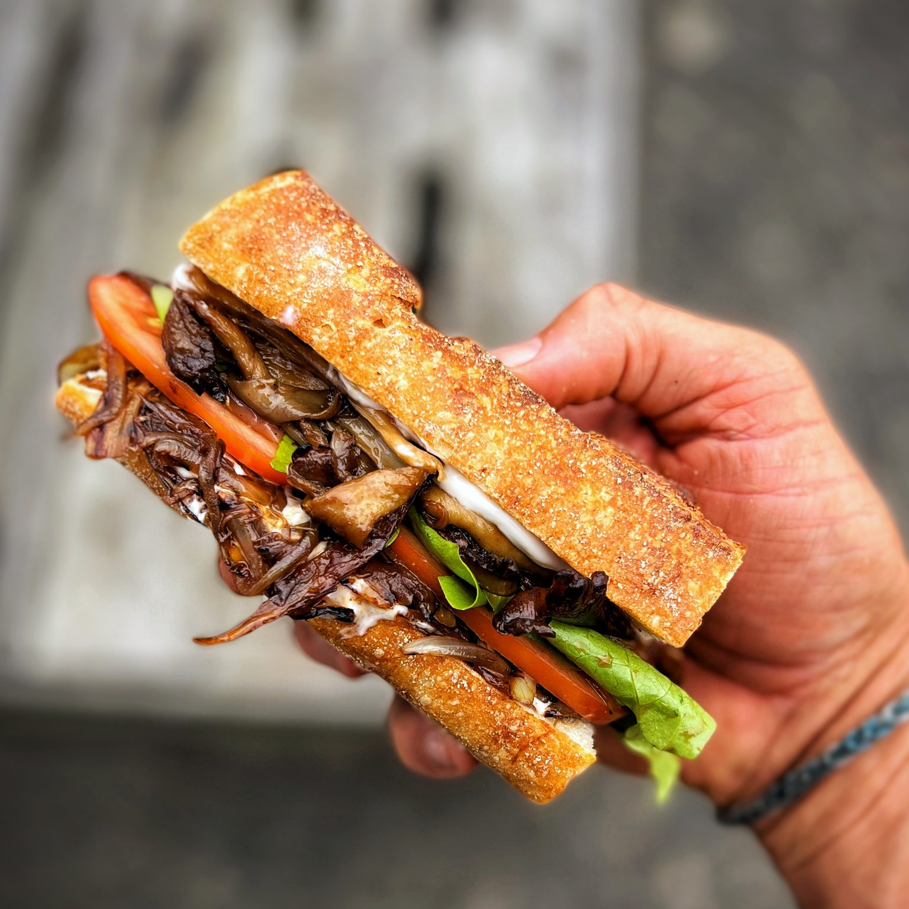

## **EASY MUSHROOM STEAK SANDWICH**

---

## A super tasty crowd pleasing treat of a sandwich, here we compress mushrooms to release their “steak-like” texture – this easy mushroom steak sandwich is so easy to make and incredible tasty!

---

### **INGREDIENTS** __________

- 1 large baguette or bread
  roll
- 2 tbsp oil
- 1 tbsp balsamic vinegar
- 3 tbsp maple syrup
- 200 g oyster mushrooms
  or mushrooms of choice
- 2 tbsp tamari/ soy sauce
- 1 tsp garlic powder
- 2 large tomato
- 2 medium onions
- A few leaves of lettuce
- 3 tbsp vegan mayo

### **INSTRUCTIONS** ____________________________________________

1. Peel and slice the onions
2. Heat a non stick pan on high heat

3. Add 1 tbsp of oil and once hot add the sliced onions, fry until  
   they start to brown stirring regularly, this should take about 5  
   mins, as they start to shrivel and go golden add in the  
   balsamic vinegar and 1.5 tbsp of maple syrup. Remove the  
   pan from the heat and mix well. Set the onions aside and  
   leave to cool.

4. Rip up the mushrooms in long strips. Put the non stick pan  
   back on high heat and once hot add 1 tbsp of oil and the  
   mushrooms. Take another pan that fits inside this pan and  
   put some baking parchment to cover the bottom of this pan and  
   compress the pan down so that the mushrooms are being  
   forced to evaporate more moisture and are forced to brown  
   and grill more. Once they start to brown on once side turn  
   them and repeat on the other side. Once they are brown all  
   over, turn off the heat and mix the 2 tbsp of tamari, 1.5 tbsp of  
   maple syrup and the garlic powder and add to the pan mixing  
   well while still hot ensuring that each mushroom is well  
   coated. Leave them to cool

5. To bring together, slice the baguette lengthwise and add a  
   generous dallop of vegan mayonnaise on each side, add a  
   nice coating of caramelised onions to one side, next some  
   sliced tomato, some lettuce and finish with a generous  
   serving of the mushrooms. Repeat with the other sandwich.  
   Enjoy!

### **NUTRITION** __________

    

    Calories: 785kcal
    Saturated Fat: 3g  
    Sodium: 1932mg  
    Vitamin A: 1075IU  
    

    

    Carbohydrates: 106g
    Polyunsaturated Fat: 6g
    Potassium: 1160mg
    Vitamin C: 25mg
    

    

    Protein: 20g
    Monounsaturated Fat: 10g
    Fiber: 9g
    Calcium: 211mg
    

    

    Fat: 32g
    Trans Fat: 1g
    Sugar: 34g
    Iron: 7mg
    

